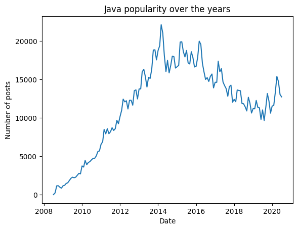
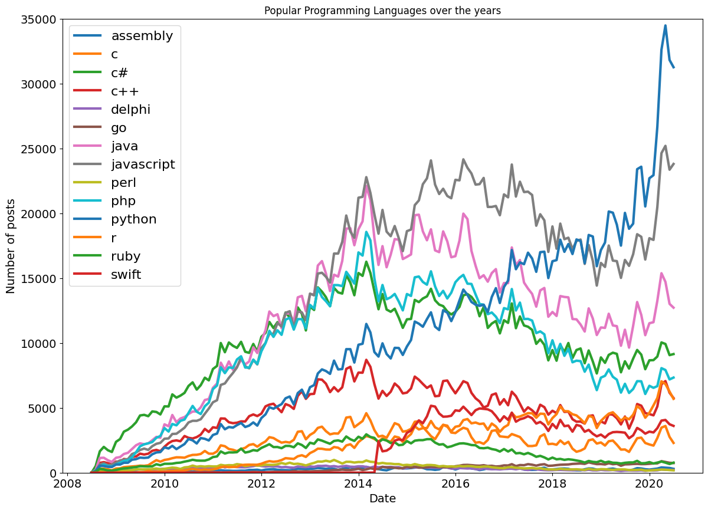
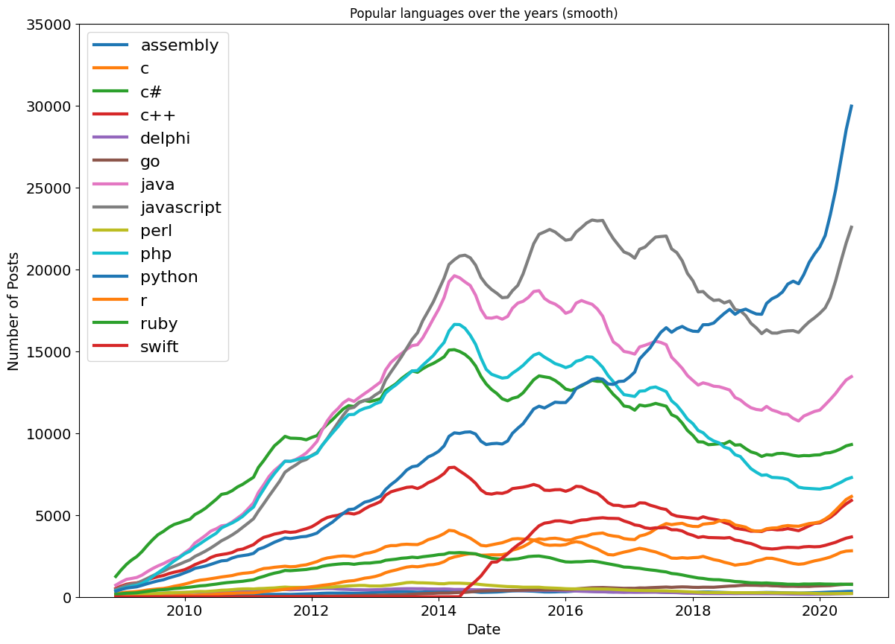

# 📊 Data Exploration and Data Visualization of the top programming languages.

This notebook explores the `Stack Overflow` dataset to see which programming languages are the most talked about in the community. We always wonder which language shoud we start learning, now we can make our decision by looking at what others are using.

---

## 📁 Dataset

The dataset contains monthly post counts for various programming language tags on Stack Overflow, starting from July 2008.

Each row includes:

-   📅 Date (month-year)
-   🏷️ Tag name (e.g., `python`, `java`, `c++`)
-   🔢 Number of posts using that tag during the month

---

## 🧪 Data Exploration

Exploratory steps include:

-   Checking the first and last few rows of the dataset.
-   Checking the `shape` and number of columns.
-   Converting the `string` dates to pandas `datetime` objects.

---

## 🔮 Data Manipulation

-   Pivoting the dataset so the columns would be programming languages and rows will be the date.
-   After pivoting, there will be many `NaN` or missing values in the dataset.

---

## 🧹 Data Cleaning

-   Handling and filling something in place of the missing values.

---

## 📈 Data Visualization

### 1. Plotting the usage of `java` over the years

    

### 2. Plotting all the languages to check which language is used most over the years

    

-   As we can see, `python` gained a lot of popularity recently, but overall `python`, `javascript`, and `java` seems to be the top 3 most popular languages.

---

## 🧼 Smoothing out Time series data

-   Smoothing out time series data means reducing short-term fluctuations (noise) in the data to better reveal long-term trends or patterns.
-   Currently, there are various ups and downs in the plots which may interfere with our visualization.
-   We should smooth time series data to remove noise and to see the overall bigger picture, rather than the small ups and downs.

### After smoothing

    

-   We can clearly see the chart now without all the noise.

---

## ## 💡 Key Insights

-   📈 `Python` has shown consistent growth and is among the most used languages.
-   🔻 Languages like `Perl` and `Delphi` have seen significant decline.
-   📊 `JavaScript`, `Java`, and `C#` remained top contenders over the years.
